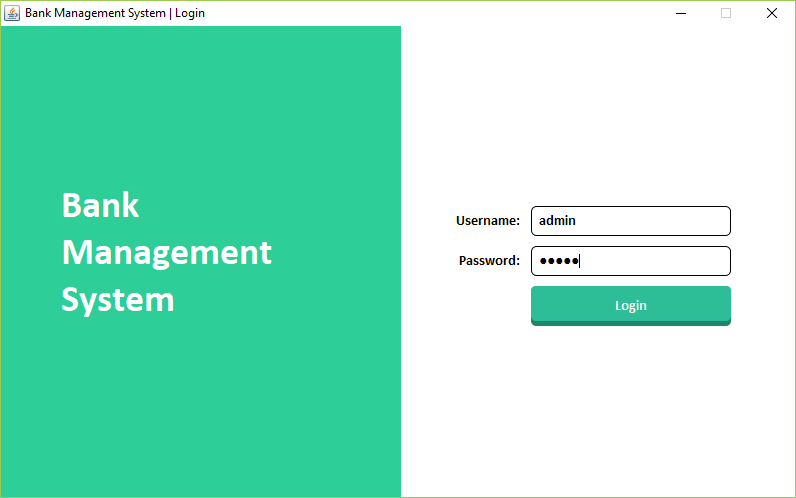
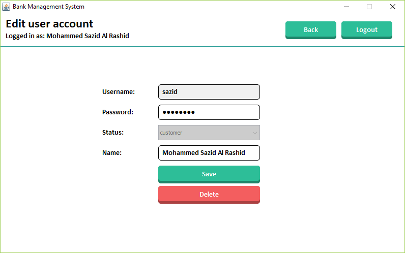
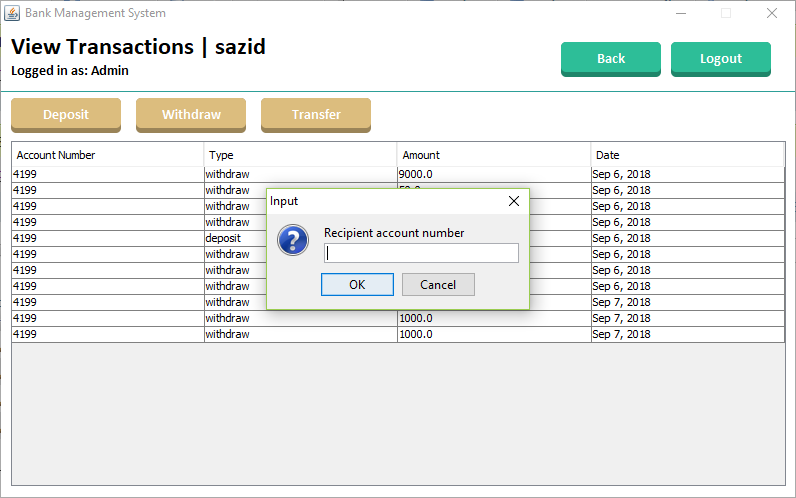

# Bank Management System

A dummy bank management system application written in Java/Swing/MySQL.

### Steps to run the program:
1. Create a database named m6
2. Import the m6.sql file into the database
3. Rename Start.txt file to Start.bat
4. Run Start.bat

Admin account

> Username: admin
> Password: admin
 
Employee account

> Username: hello
> Password: hello

Customer account

> Username: sazid
> Password: password
